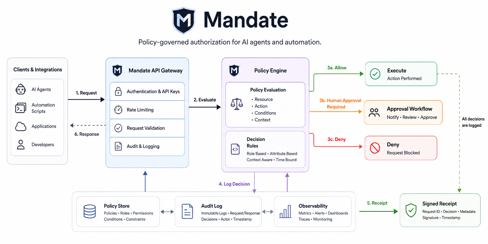

# Mandate-API

**Policy-governed authorization for AI agents and automation.**

<br clear="left" />

[](https://github.com/MrrAmissah/Mandate/actions/workflows/ci.yml)
[](https://github.com/MrrAmissah/Mandate/actions/workflows/ci.yml)
[](./LICENSE)


Mandate-API is a provider-independent trust layer for AI agents: delegated authorization, durable approval authority, database-time approval expiry, authority-scoped approver inboxes, single-use execution attempts, and cryptographically signed action receipts.

It answers six questions ordinary application authorization does not answer well:

1. What may this specific agent do for this task, resource, and time window?
2. Which durable human approver identities are actually eligible to decide a sensitive request?
3. Which pending approvals are genuinely actionable by the human identity behind this authenticated credential right now?
4. When does approval authority actually stop, including after an approval was granted but not yet consumed?
5. Which caller acquired and completed the one execution opportunity represented by an authorization decision?
6. What verifiable evidence records the authority, execution, outcome, and any later append-only correction?

## Target architecture concept

> **Directional concept, not a literal map of the current runtime.** The implemented service issues a root receipt only after an `ALLOW` decision has been reserved and its action attempt reaches `COMPLETED`. Audit logs and observability never mint receipts. Rate limiting, broad RBAC/ABAC administration, integration clients, and full dashboards shown below remain future controls unless described as implemented elsewhere in this README.

<p align="center">
  
</p>

Mandate-API sits between agents and tools. It allows permitted actions, pauses sensitive actions for assigned human approval, blocks prohibited actions, enforces approval deadlines with PostgreSQL time, and records completed execution as independently verifiable evidence. The exact implemented lifecycle is documented in **Core flow** below.

## Current milestone: durable execution, approval authority, deadline enforcement, evidence and operational foundation

The current platform binds authorization decisions to one execution attempt, terminal evidence, one immutable root receipt, and an optional linear chain of signed correction receipts. Sensitive approval requests are bound to durable approver identities or assignment-time group snapshots instead of caller-supplied human text. The approver-facing inbox derives visibility from the authenticated credential's live approver binding, current assignment, and immutable eligibility snapshot rather than from broad administrative approval-read authority.

PostgreSQL time is now the approval deadline authority. An overdue `PENDING` approval cannot be decided, reassigned, or cancelled after the database deadline. An approval that was validly `APPROVED` before its deadline still cannot be consumed after that deadline. A separately supervised approval-expiry worker converges overdue `PENDING` and `APPROVED` records to durable `EXPIRED` state, terminates active assignments, and writes immutable audit/outbox evidence. Action-attempt reservations retain their own separate expiry process and database identity.

Implemented now:

- scoped mandates with expiry, revocation, resource boundaries, deny precedence, and use limits;
- deterministic `ALLOW`, `DENY`, and `REQUIRE_APPROVAL` decisions;
- tenant/environment-scoped durable approver identities with active/disabled lifecycle;
- revocable API-credential-to-approver bindings that keep human identity separate from authentication mechanism;
- approver groups with history-preserving membership lifecycle;
- direct and group approval assignments with immutable assignment-time eligibility snapshots;
- late group membership additions prevented from expanding authority over already-pending approvals;
- explicit approval reassignment and cancellation with preserved history;
- dedicated `approvals:decide` authority separate from approval administration;
- dedicated `approval_inbox:read` authority separate from broad `approvals:read` administration;
- an approver inbox that requires the current authenticated credential, active approver identity, active assignment, and immutable eligibility snapshot;
- `ACTIONABLE` inbox filtering that excludes overdue requests and `PENDING` inspection that can show overdue-but-unmaterialized requests without representing them as actionable;
- cursor/keyset-paginated inbox reads backed by approver-first and pending-order PostgreSQL indexes;
- reassigned and terminal approvals removed from the former/current approver inbox without rewriting assignment history;
- server-derived approval decision attribution; caller-supplied `decidedBy` is not authoritative;
- fail-closed rejection of ambiguous credential-binding selectors;
- PostgreSQL final-arbiter checks requiring an active eligible approver plus immutable `approval.decided` audit evidence tied to the exact active credential binding before a pending approval can commit as approved/rejected;
- PostgreSQL `clock_timestamp()` enforcement for approval decision, reassignment/new assignment, cancellation, consumption, and expiry precedence;
- durable `PENDING → EXPIRED` and `APPROVED → EXPIRED` materialization with immutable `expiredAt`, `expirationReason`, and `expirationRequestId` evidence;
- active approval assignments terminated as `EXPIRED` in the same transaction as approval expiry;
- immutable `approval.expired` audit/outbox evidence including the prior approval state;
- a dedicated supervised approval-expiry worker with bounded `FOR UPDATE SKIP LOCKED` claims, cached backlog metrics, liveness/readiness and signal-aware shutdown;
- exact, single-use approval consumption by authorization, including fail-closed rejection after the approval deadline;
- one action-attempt reservation per allowed decision;
- bounded reservation windows and dedicated attempt scopes;
- controlled attempt completion and cancellation by the reserving credential;
- database-time materialization of overdue action-attempt reservations as `EXPIRED` through a separate worker;
- immutable input/output hashes and tool metadata for completed attempts;
- receipt v1.1 root issuance only from completed attempts;
- one immutable root receipt per attempt and decision;
- append-only receipt v1.2 successors with signed predecessor references and reasons;
- exactly one direct successor per predecessor, producing a non-forking correction chain;
- predecessor verification through active or retired scoped keys before correction;
- Ed25519 signing with persistent rotation, retirement, revocation, discovery, and historical verification;
- a zero-dependency offline receipt verifier with TypeScript declarations and public conformance fixtures;
- reproducible verifier tarballs with SHA-256 and npm integrity manifests in CI;
- tenant and `test`/`live` isolation;
- high-entropy API credentials with hash-only durable records;
- payload-bound idempotency with exact committed HTTP replay;
- database-time, bounded idempotency replay cleanup with a seven-day safety floor;
- atomic domain, audit-event, and outbox writes;
- cursor-paginated resource collections where documented by the contract;
- tenant-aware PostgreSQL persistence;
- serializable transactions and one-winner concurrency tests;
- a standalone supervised outbox worker with trusted exact local handlers, bounded retries, stale-lease recovery, readiness and metrics;
- controlled dead-letter inspection and replay that preserves failed history and immutable operator evidence;
- separate migration, API, action-attempt-expiry, approval-expiry, outbox, maintenance and operator PostgreSQL authorities with fail-closed role policy;
- cross-worker database-role tests proving the two expiry workers cannot mutate each other's domain tables;
- a non-root/read-only production image and deployment-neutral Compose topology with health checks, restart/shutdown rules, CPU/memory/PID/log bounds and private worker operations surfaces;
- snapshot-consistent PostgreSQL backup/restore tooling with SHA-256 manifests and disposable restore targets;
- recovery-critical verification requiring migration `014_approval_expiry` and preserving approval authority/deadline evidence alongside receipts, keys and outbox state;
- a real PostgreSQL recovery drill proving migration continuity, idempotent API replay, approval-authority continuity, historical receipt/key verification and outbox/dead-letter continuity;
- a deployment-neutral production-operations contract with initial health/metric alert baselines and rollback/escalation rules;
- real PostgreSQL restart, isolation, approval-assignment, approval-inbox, approval-expiry/consumption-race, decision-concurrency, attempt, receipt, supersession, outbox, key-rotation, replay, retention, database-role and recovery tests.

Memory mode remains available for local API experiments. Live API environments require PostgreSQL, explicit scopes, a non-default API key, an explicit persistent key ID, persistent receipt-signing keys, and separately supervised workers where their durable convergence functions are required.

## Run locally

```bash
cp .env.example .env
export MANDATE_API_KEY=local-development-only
npm test
npm start
```

The API starts on `http://localhost:8787`.

After applying migrations, run the two expiry processes separately:

```bash
npm run migrate

MANDATE_STORE=postgres \
MANDATE_ENVIRONMENT=test \
MANDATE_EXPIRY_WORKER_ID=expiry-worker-local-01 \
npm run worker:attempt-expiry
```

```bash
MANDATE_STORE=postgres \
MANDATE_ENVIRONMENT=test \
MANDATE_APPROVAL_EXPIRY_WORKER_ID=approval-expiry-worker-local-01 \
npm run worker:approval-expiry
```

Neither expiry process uses the API key or applies migrations. Their operational listeners default to loopback:

| Process | Port | Routes |
|---|---:|---|
| Action-attempt expiry | `8788` | `/health/live`, `/health/ready`, `/metrics` |
| Approval expiry | `8790` | `/health/live`, `/health/ready`, `/metrics` |

These are operational endpoints, not part of the public Mandate API contract. Binding them beyond loopback requires deployment network controls.

Run idempotency retention cleanup as a controlled one-shot maintenance job:

```bash
MANDATE_STORE=postgres \
MANDATE_ENVIRONMENT=test \
MANDATE_IDEMPOTENCY_RETENTION_SECONDS=604800 \
npm run idempotency:cleanup
```

Cleanup uses PostgreSQL time, bounded `SKIP LOCKED` batches, and a hard seven-day minimum. It uses no API credential and never applies migrations.

## Verify a receipt offline

The package under `packages/receipt-verifier` verifies a receipt against an already obtained discovery key set without calling the API:

```js
import { verifyMandateReceipt } from '@mandate-api/receipt-verifier';

const result = verifyMandateReceipt(receipt, discoveryResponse);
if (!result.valid) {
  console.error(result.reason);
}
```

The package uses the same canonical JSON implementation as server issuance and verification. It accepts active and retired Ed25519 keys, rejects revoked or malformed keys, and returns stable machine-readable failure reasons.

Receipt v1.2 predecessor references and correction reasons are ordinary signed fields, so any change invalidates verification. The verifier validates individual receipts; applications that consume a complete correction chain must additionally validate linkage, preserved execution evidence, and chain completeness.

The committed conformance fixture contains only a public key and signed receipt. No private test key is stored in the repository.

## Core flow

```text
Principal defines authority
          ↓
Agent proposes an action
          ↓
Mandate-API evaluates policy
          ↓
ALLOW / DENY / REQUIRE_APPROVAL
                  ↓
        approval assigned to one approver
        or an assignment-time group snapshot
                  ↓
     approver inbox derives current authority
                  ↓
        authenticated eligible approver decides
                  ↓
        before expiresAt? ─────── no ─────→ EXPIRED
                  ↓ yes
             APPROVED
                  ↓
       consumed before expiresAt?
          ↓ yes             ↓ no
        ALLOW             EXPIRED
          ↓
Caller reserves the ALLOW decision once
          ↓
Tool executes within the reservation window
          ↓
Caller completes the attempt with hashes and tool metadata
          ↓
Mandate-API signs an immutable v1.1 root receipt
          ↓ optional correction
Mandate-API verifies the predecessor and appends a v1.2 successor
```

A valid API key is not, by itself, approval authority. A decision requires the dedicated scope, an active credential binding to a durable approver identity, an active assignment, membership in that assignment's immutable eligibility snapshot, and an immutable decision audit event carrying the same credential/approver/assignment proof. Group membership added after assignment does not authorize that old request.

Likewise, broad `approvals:read` access is not approver inbox authority. The inbox requires `approval_inbox:read` plus a live approver binding and current immutable assignment eligibility. A reassignment removes the item from the old assignee's current inbox. A terminal approval disappears. An overdue request that remains durably `PENDING` can be inspected through `state=PENDING`, but it is always returned with `actionable=false` until the approval-expiry worker materializes `EXPIRED`.

Approval deadlines are not extended by approval itself. A request validly moved to `APPROVED` before `expiresAt` must also be consumed before `expiresAt`. PostgreSQL rejects a late consumption even if the application clock is stale, and the worker converges the record to `EXPIRED` with immutable system evidence.

Unused action-attempt reservations are independently materialized as `EXPIRED` by their own PostgreSQL-backed worker. A `RESERVED` attempt is not proof that execution started or succeeded; only a `COMPLETED` attempt can issue a root receipt. Supersession never changes the attempt or root receipt.

## Example mandate

```json
{
  "principalId": "user_prince",
  "agentId": "agent_coder",
  "purpose": "Inspect a repository and open a draft pull request",
  "resources": ["github:MrrAmissah/demo-api"],
  "allowedActions": [
    "repository.read",
    "branch.create",
    "commit.create",
    "pull_request.create_draft"
  ],
  "deniedActions": [
    "pull_request.merge",
    "repository.settings.*"
  ],
  "approvalRequiredActions": ["commit.create"],
  "validUntil": "2030-01-01T00:00:00Z",
  "maxUses": 20
}
```

## API surface

| Method | Route | Purpose |
|---|---|---|
| `GET` | `/health` | Health check |
| `GET` | `/.well-known/mandate-keys` | Active and retired public verification keys |
| `POST`, `GET` | `/v1/mandates` | Create or list mandates |
| `GET` | `/v1/mandates/:id` | Retrieve a mandate |
| `POST` | `/v1/mandates/:id/revoke` | Revoke a mandate |
| `POST`, `GET` | `/v1/approver-identities` | Create or list approver identities |
| `POST` | `/v1/approver-identities/:id/bindings` | Bind either the authenticated credential or one explicit credential |
| `POST` | `/v1/approver-identities/:id/bindings/revoke` | Revoke an active credential binding |
| `POST` | `/v1/approver-identities/:id/disable` | Disable an approver identity |
| `POST`, `GET` | `/v1/approver-groups` | Create or list approver groups |
| `POST` | `/v1/approver-groups/:id/members` | Add a member for future assignment snapshots |
| `POST` | `/v1/approver-groups/:id/members/:approverId/remove` | Remove a member for future assignment snapshots |
| `POST`, `GET` | `/v1/approvals` | Request or list assigned approvals |
| `GET` | `/v1/approvals/:id` | Retrieve an approval, including durable expiry evidence when applicable |
| `GET` | `/v1/approvals/:id/assignment` | Retrieve the active assignment and immutable eligibility snapshot |
| `POST` | `/v1/approvals/:id/reassign` | Replace the active assignment with a new snapshot before the deadline |
| `POST` | `/v1/approvals/:id/cancel` | Cancel a pending approval with durable operator evidence before the deadline |
| `POST` | `/v1/approvals/:id/decide` | Approve or reject as the authenticated eligible approver before the database deadline |
| `GET` | `/v1/approval-inbox` | List current authority-scoped approval work (`ACTIONABLE` by default or all `PENDING`) |
| `GET` | `/v1/approval-inbox/:id` | Inspect one currently visible pending approval inbox item |
| `POST` | `/v1/authorize` | Evaluate an agent action; approved approval consumption is deadline-guarded |
| `GET` | `/v1/decisions`, `/v1/decisions/:id` | List or retrieve immutable decisions |
| `POST`, `GET` | `/v1/action-attempts` | Reserve or list execution attempts |
| `GET` | `/v1/action-attempts/:id` | Retrieve an action attempt |
| `POST` | `/v1/action-attempts/:id/complete` | Store terminal execution evidence |
| `POST` | `/v1/action-attempts/:id/cancel` | Cancel an unused reservation |
| `POST`, `GET` | `/v1/receipts` | Issue a root receipt or list receipts |
| `GET` | `/v1/receipts/:id` | Retrieve a receipt |
| `POST` | `/v1/receipts/:id/supersede` | Append one signed correction successor |
| `POST` | `/v1/receipts/verify` | Verify using active or retired registered keys |

Approval expiry itself has no public mutation endpoint. It is an internal, database-authoritative convergence process.

See [`openapi.yaml`](./openapi.yaml) for the stable v0.10.0 contract.

## Documentation

- [Product blueprint](./docs/PRODUCT_BLUEPRINT.md)
- [API conventions](./docs/API_CONVENTIONS.md)
- [Action attempts and receipts](./docs/ACTION_ATTEMPTS.md)
- [Action-attempt expiry process](./docs/ACTION_ATTEMPT_EXPIRY.md)
- [Receipt supersession](./docs/RECEIPT_SUPERSESSION.md)
- [Receipt verification](./docs/RECEIPT_VERIFICATION.md)
- [Signing-key operations](./docs/SIGNING_KEYS.md)
- [Idempotency and HTTP replay](./docs/IDEMPOTENCY.md)
- [Transactional outbox execution](./docs/OUTBOX.md)
- [Target architecture](./docs/ARCHITECTURE.md)
- [Security model](./docs/SECURITY_MODEL.md)
- [Persistence and transaction contract](./docs/PERSISTENCE.md)
- [Production deployment](./docs/PRODUCTION_DEPLOYMENT.md)
- [Production supervision and operations](./docs/PRODUCTION_OPERATIONS.md)
- [Database backup and recovery](./docs/DATABASE_RECOVERY.md)
- [Delivery roadmap](./docs/ROADMAP.md)
- [Database migrations](./migrations/)
- [Project assets](./assets/)

## Security invariants

- Explicit deny rules override every allow rule.
- Cross-tenant access is indistinguishable from a missing object.
- A valid API credential is not automatically a human approver identity.
- New approval decisions never trust caller-supplied `decidedBy` text.
- A credential-binding request cannot contain both current-credential and explicit-credential selectors.
- Only an active approver identity bound to the authenticated credential and included in the active assignment snapshot may decide.
- `approvals:read` does not grant authority-scoped inbox access; the inbox requires `approval_inbox:read` and a live approver binding.
- Inbox item visibility requires the current active assignment and its immutable eligibility snapshot; superseded assignments do not remain actionable.
- Overdue-but-unmaterialized pending approvals may be inspected but are never reported as actionable.
- Group eligibility is snapshotted at assignment time; later membership additions cannot expand authority over an existing request.
- Reassignment/cancellation preserve prior assignment history rather than rewriting it.
- PostgreSQL independently rejects terminal approval decisions unless immutable audit evidence proves the same active credential binding, approver identity and active assignment eligibility at decision time.
- PostgreSQL time, not an application-host clock, determines approval decision/reassignment/cancellation/consumption deadlines and durable approval expiry.
- Overdue `PENDING` and `APPROVED` approvals converge only to `EXPIRED`; an expired approval cannot retain an active assignment.
- A validly approved approval cannot be consumed after its deadline.
- An allowed decision, mandate-use increment, approval consumption, audit event, and outbox row belong to one transaction.
- The final mandate use and an approved approval can each be consumed only once under concurrency.
- One allowed decision can be reserved by at most one action attempt.
- Only the reserving credential may complete or cancel an attempt.
- PostgreSQL time determines live action-attempt reservation expiry and backlog age.
- Health probes read cached metrics and never create per-probe database traffic.
- Terminal attempt evidence cannot be overwritten.
- Cancelled, reserved, and expired attempts cannot issue receipts.
- A raw authorization decision cannot issue a receipt through the public runtime.
- One completed attempt and decision produce at most one immutable root receipt.
- Each receipt may have at most one direct successor; a successor retains the same decision and action-attempt identity.
- The predecessor must verify through an active or retired key before a successor is signed.
- Receipt signatures cover every receipt field except the signature itself.
- Server and offline verification share one canonical JSON implementation.
- Active and retired keys verify historical receipts; revoked keys do not.
- Raw generated API credentials are displayed once and are not stored durably.
- Authorization decisions, receipts, audit events, outbox attempts, dead-letter replay records and approval eligibility snapshots are immutable in PostgreSQL.
- Approval decision, cancellation and expiry evidence is immutable after it becomes terminal evidence.
- Workers may mutate only the exact rows claimed within their transactions.
- The action-attempt and approval-expiry workers use distinct PostgreSQL roles and cannot mutate each other's domain tables.
- Unknown idempotency operation scopes are rejected instead of receiving guessed HTTP metadata.
- Idempotency cleanup cannot shorten the seven-day replay floor or cross tenant/environment scope.
- Runtime and worker database identities cannot migrate, own schema objects, inherit broad roles, or silently gain default grants.
- Dead letters are never automatically replayed or reset in place.
- Recovery verification requires migration `014_approval_expiry` and exact migration/trust-state continuity before a backup is accepted as a proven restore artifact.
- API readiness requires migration `014_approval_expiry`, which also implies the migration-013 inbox indexes are present.

## Not production-ready yet

The repository now has durable PostgreSQL state, durable single-approver/group assignment authority, an authority-scoped approver inbox, database-time approval expiry, separate least-privilege expiry workers, controlled dead-letter operations, snapshot-consistent recovery proof and a deployment-neutral supervision baseline. It is still **not ready for consequential autonomous production use** until the chosen deployment supplies and proves the remaining external controls: TLS termination and firewall/trusted-proxy policy, paging and centralized logs/SIEM, production backup scheduling/PITR with measured RPO/RTO, HA/failover where required, an approved live dead-letter replay process, an externally reviewed real delivery handler, container vulnerability/SBOM/provenance controls, and the later approval-evidence, multi-party approval, integration, SDK and enterprise work described in the roadmap.
