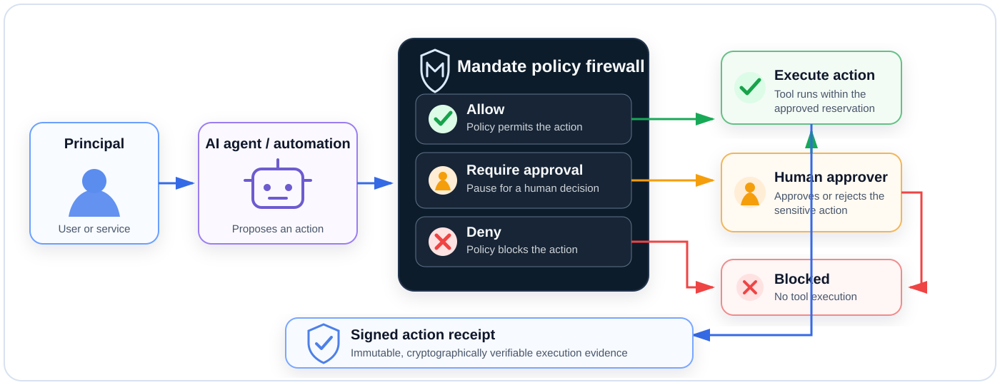

<p align="center">
  
</p>

# Mandate-API

**Mandate-API is a provider-independent trust layer for AI agents: delegated authorization, approval gates, single-use execution attempts, and cryptographically signed action receipts.**

It answers three questions ordinary application authorization does not answer well:

1. What may this specific agent do for this task, resource, and time window?
2. Which caller acquired and completed the one execution opportunity represented by an authorization decision?
3. What verifiable evidence records the authority, execution, outcome, and any later append-only correction?

## Architecture at a glance

<p align="center">
  
</p>

Mandate-API sits between agents and tools. It allows permitted actions, pauses sensitive actions for human approval, blocks prohibited actions, and records completed execution as independently verifiable evidence.

## Current milestone: durable execution and receipt lifecycle

The current platform binds authorization decisions to one execution attempt, terminal evidence, one immutable root receipt, and an optional linear chain of signed correction receipts. PostgreSQL time also expires unused reservations through a separately composed worker process.

Implemented now:

- scoped mandates with expiry, revocation, resource boundaries, deny precedence, and use limits;
- deterministic `ALLOW`, `DENY`, and `REQUIRE_APPROVAL` decisions;
- exact, single-use human approvals;
- one action-attempt reservation per allowed decision;
- bounded reservation windows and dedicated attempt scopes;
- controlled attempt completion and cancellation by the reserving credential;
- database-time materialization of overdue reservations as `EXPIRED`;
- a dedicated, signal-aware expiry-worker process with migration-readiness checks;
- cached database-time backlog counts and oldest-overdue age;
- loopback-default liveness, readiness, and Prometheus metrics for the expiry process;
- immutable input/output hashes and tool metadata for completed attempts;
- receipt v1.1 root issuance only from completed attempts;
- one immutable root receipt per attempt and decision;
- append-only receipt v1.2 successors with signed predecessor references and reasons;
- exactly one direct successor per predecessor, producing a non-forking correction chain;
- predecessor verification through active or retired scoped keys before correction;
- Ed25519 signing with persistent rotation, retirement, revocation, discovery, and historical verification;
- a zero-dependency offline receipt verifier with TypeScript declarations and public conformance fixtures;
- reproducible verifier tarballs with SHA-256 and npm integrity manifests in CI;
- tenant and `test`/`live` isolation;
- high-entropy API credentials with hash-only durable records;
- payload-bound idempotency with exact committed HTTP replay;
- atomic domain, audit-event, and outbox writes;
- cursor-paginated resource collections;
- tenant-aware PostgreSQL persistence;
- serializable transactions and one-winner concurrency tests;
- leased outbox claims, retries, stale-lease recovery, and dead-letter transitions;
- real PostgreSQL restart, isolation, attempt, expiry, backlog, receipt, supersession, approval, outbox, key-rotation, and replay tests.

Memory mode remains available for local API experiments. Live API environments require PostgreSQL, explicit scopes, a non-default API key, an explicit persistent key ID, and persistent receipt-signing keys.

## Run locally

```bash
cp .env.example .env
export MANDATE_API_KEY=local-development-only
npm test
npm start
```

The API starts on `http://localhost:8787`.

After applying migrations, run the expiry process separately:

```bash
npm run migrate
MANDATE_STORE=postgres \
MANDATE_ENVIRONMENT=test \
MANDATE_EXPIRY_WORKER_ID=expiry-worker-local-01 \
npm run worker:attempt-expiry
```

The expiry process does not use the API key and never applies migrations itself. Its operational listener defaults to `http://127.0.0.1:8788`:

| Route | Purpose |
|---|---|
| `/health/live` | Dedicated process liveness |
| `/health/ready` | Recent successful-cycle readiness |
| `/metrics` | Cached Prometheus counters and backlog gauges |

These are operational endpoints, not part of the public Mandate API contract. Binding them beyond loopback requires deployment network controls.

## Verify a receipt offline

The package under `packages/receipt-verifier` verifies a receipt against an already obtained discovery key set without calling the API:

```js
import { verifyMandateReceipt } from '@mandate-api/receipt-verifier';

const result = verifyMandateReceipt(receipt, discoveryResponse);
if (!result.valid) {
  console.error(result.reason);
}
```

The package uses the same canonical JSON implementation as server issuance and verification. It accepts active and retired Ed25519 keys, rejects revoked or malformed keys, and returns stable machine-readable failure reasons.

Receipt v1.2 predecessor references and correction reasons are ordinary signed fields, so any change invalidates verification. The verifier validates individual receipts; applications that consume a complete correction chain must additionally validate linkage, preserved execution evidence, and chain completeness.

The committed conformance fixture contains only a public key and signed receipt. No private test key is stored in the repository.

## Core flow

```text
Principal defines authority
          ↓
Agent proposes an action
          ↓
Mandate-API evaluates policy
          ↓
ALLOW / DENY / REQUIRE_APPROVAL
          ↓
Caller reserves the ALLOW decision once
          ↓
Tool executes within the reservation window
          ↓
Caller completes the attempt with hashes and tool metadata
          ↓
Mandate-API signs an immutable v1.1 root receipt
          ↓ optional correction
Mandate-API verifies the predecessor and appends a v1.2 successor
```

Unused reservations are materialized as `EXPIRED` by the PostgreSQL-backed expiry process. A `RESERVED` attempt is not proof that execution started or succeeded; only a `COMPLETED` attempt can issue a root receipt. Supersession never changes the attempt or root receipt.

## Example mandate

```json
{
  "principalId": "user_prince",
  "agentId": "agent_coder",
  "purpose": "Inspect a repository and open a draft pull request",
  "resources": ["github:MrrAmissah/demo-api"],
  "allowedActions": [
    "repository.read",
    "branch.create",
    "commit.create",
    "pull_request.create_draft"
  ],
  "deniedActions": [
    "pull_request.merge",
    "repository.settings.*"
  ],
  "approvalRequiredActions": ["commit.create"],
  "validUntil": "2030-01-01T00:00:00Z",
  "maxUses": 20
}
```

## API surface

| Method | Route | Purpose |
|---|---|---|
| `GET` | `/health` | Health check |
| `GET` | `/.well-known/mandate-keys` | Active and retired public verification keys |
| `POST`, `GET` | `/v1/mandates` | Create or list mandates |
| `GET` | `/v1/mandates/:id` | Retrieve a mandate |
| `POST` | `/v1/mandates/:id/revoke` | Revoke a mandate |
| `POST`, `GET` | `/v1/approvals` | Request or list approvals |
| `GET` | `/v1/approvals/:id` | Retrieve an approval |
| `POST` | `/v1/approvals/:id/decide` | Approve or reject |
| `POST` | `/v1/authorize` | Evaluate an agent action |
| `GET` | `/v1/decisions`, `/v1/decisions/:id` | List or retrieve immutable decisions |
| `POST`, `GET` | `/v1/action-attempts` | Reserve or list execution attempts |
| `GET` | `/v1/action-attempts/:id` | Retrieve an action attempt |
| `POST` | `/v1/action-attempts/:id/complete` | Store terminal execution evidence |
| `POST` | `/v1/action-attempts/:id/cancel` | Cancel an unused reservation |
| `POST`, `GET` | `/v1/receipts` | Issue a root receipt or list receipts |
| `GET` | `/v1/receipts/:id` | Retrieve a receipt |
| `POST` | `/v1/receipts/:id/supersede` | Append one signed correction successor |
| `POST` | `/v1/receipts/verify` | Verify using active or retired registered keys |

See [`openapi.yaml`](./openapi.yaml) for the stable v0.7.0 contract.

## Documentation

- [Product blueprint](./docs/PRODUCT_BLUEPRINT.md)
- [API conventions](./docs/API_CONVENTIONS.md)
- [Action attempts and receipts](./docs/ACTION_ATTEMPTS.md)
- [Action-attempt expiry process](./docs/ACTION_ATTEMPT_EXPIRY.md)
- [Receipt supersession](./docs/RECEIPT_SUPERSESSION.md)
- [Receipt verification](./docs/RECEIPT_VERIFICATION.md)
- [Signing-key operations](./docs/SIGNING_KEYS.md)
- [Idempotency and HTTP replay](./docs/IDEMPOTENCY.md)
- [Target architecture](./docs/ARCHITECTURE.md)
- [Security model](./docs/SECURITY_MODEL.md)
- [Persistence and transaction contract](./docs/PERSISTENCE.md)
- [Transactional outbox execution](./docs/OUTBOX.md)
- [Delivery roadmap](./docs/ROADMAP.md)
- [Database migrations](./migrations/)
- [Project assets](./assets/)

## Security invariants

- Explicit deny rules override every allow rule.
- Cross-tenant access is indistinguishable from a missing object.
- An allowed decision, mandate-use increment, approval consumption, audit event, and outbox row belong to one transaction.
- The final mandate use and an approved approval can each be consumed only once under concurrency.
- One allowed decision can be reserved by at most one action attempt.
- Only the reserving credential may complete or cancel an attempt.
- PostgreSQL time, not an application-host clock, determines live reservation expiry and backlog age.
- Health probes read cached metrics and never create per-probe database traffic.
- Terminal attempt evidence cannot be overwritten.
- Cancelled, reserved, and expired attempts cannot issue receipts.
- A raw authorization decision cannot issue a receipt through the public runtime.
- One completed attempt and decision produce at most one immutable root receipt.
- Each receipt may have at most one direct successor; a successor retains the same decision and action-attempt identity.
- The predecessor must verify through an active or retired key before a successor is signed.
- PostgreSQL supersession takes an exclusive row lock on the predecessor receipt and a shared row lock on its verification key until the successor commits.
- Receipt signatures cover every receipt field except the signature itself.
- Server and offline verification share one canonical JSON implementation.
- Active and retired keys verify historical receipts; revoked keys do not.
- Raw generated API credentials are displayed once and are not stored durably.
- Authorization decisions, receipts, audit events, and outbox attempts are immutable in PostgreSQL.
- Workers may mutate only the exact rows claimed within their transactions.
- Unknown idempotency operation scopes are rejected instead of receiving guessed HTTP metadata.

## Not production-ready yet

PostgreSQL mode is restart-safe for the implemented state, but the platform is not yet ready for consequential autonomous actions. Platform-specific service manifests, restricted deployment roles, network policy, alert thresholds, supervisor restart policy, backup/restore, dead-letter operations, idempotency retention cleanup, npm publication and provenance attestation, external delivery handlers, SDKs, and deployment runbooks remain open.
